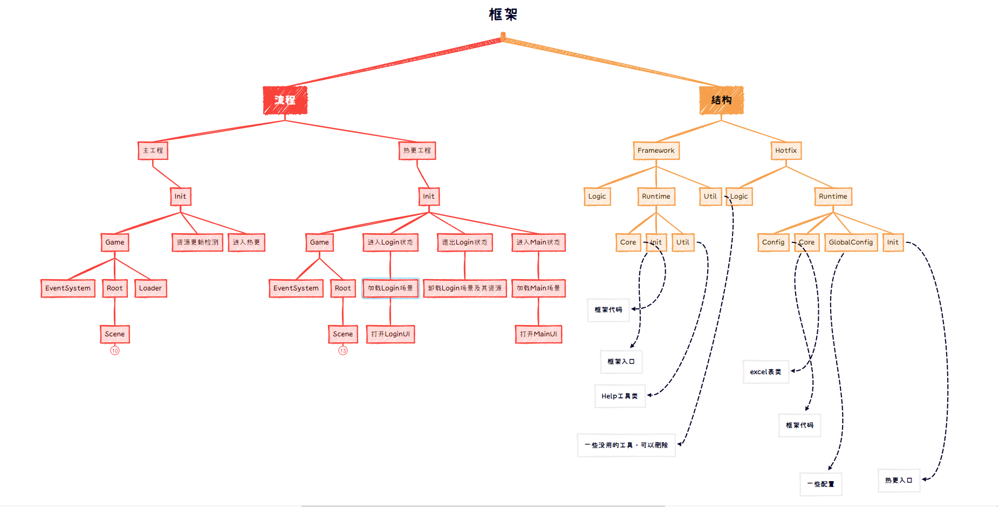
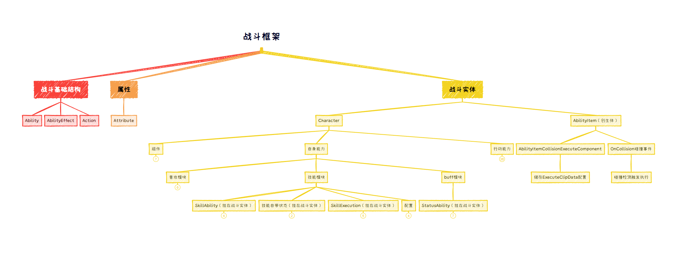

# Lcc
Lcc框架
优点：高扩展，低耦合，快速开发

## V1.0
**简介**
[Lcc](https://github.com/404Lcc/Lcc)是针对Unity开发的轻量级框架，可快速上手开发**Steam**、**安卓**、**IOS**等项目

**Lcc框架交流群**
群号: [679054092](https://jq.qq.com/?_wv=1027&k=KPEIZeok)

**特点**
1. 适配ILRuntime、Hybridclr，组件化开发，替代MonoBehaviour并对原有的生命周期进行拓展
2. 底层封装管理器，代码结构清晰
3. 提供MVVM，继承即可使用
4. 提供UI层级管理
5. 提供编辑器工具帮助快速配置项目出包
6. 提供主工程集与热更程集代码模板，无需编写样板代码
7. 提供可视化工具，帮助快速开发，解决bug
8. 提供对象里字段的自动化查找，无需手动编写查找代码或拖拽
9. 定义模块事件，编写Handler即可处理，需传开启新模块所需数据，达到解耦效果，结构清晰
10. 代码全自动加密
11. 提供数据导出工具，通过Excel快速导出数据表和数据类
12. 自动编译代码
13. 提供战斗框架

**提供功能**
1. UI层级管理
2. 场景状态管理
3. 音频管理
4. 多文本管理
5. AStar寻路
6. 数据加密
7. 事件系统
8. 命令系统
9. 网络系统等
10. 红点系统等

## 框架流程图

## 战斗流程图

## 热更新方案
1. [Lua](https://github.com/Tencent/xLua)热更方案
2. [ILRuntime](https://github.com/Ourpalm/ILRuntime)热更方案
3. [Hybridclr](https://github.com/focus-creative-games/hybridclr)热更方案

## ILRuntime热更新注意项
1. 组件缓存
2. for代替foreach
3. 适配器可通过编辑器工具生成基础模板，大部分时候不用自己编写
4. 打包之前一定要生成CLR绑定代码，否则会被IL2CPP裁剪

## 其他战斗框架
1. [EGamePlay](https://github.com/m969/EGamePlay)
2. [AbilitySystem](https://github.com/weichx/AbilitySystem)
3. [SkillSystem](https://github.com/dongweiPeng/SkillSystem)
4. [SkillEngine](https://github.com/mry-ship/SkillEngine)

## 收费插件
1. [Odin Inspector](https://assetstore.unity.com/packages/tools/utilities/odin-inspector-and-serializer-89041)

## 开发环境
- Unity2021.3.8

## 贡献成员
- [404Lccxy](https://github.com/404Lccxy)

## 项目
- [个人项目](https://www.taptap.com/developer/6782)

## 更多项目
- [BDFramework](https://github.com/yimengfan/BDFramework.Core)
- [ET](https://github.com/egametang/ET)
- [uMVVM](https://github.com/MEyes/uMVVM)
- [DynamicExpresso](https://github.com/dynamicexpresso/DynamicExpresso)
- [EGamePlay](https://github.com/m969/EGamePlay)
- [BundleMaster](https://github.com/mister91jiao/BundleMaster)
- [UIFrameWork](https://github.com/tinyantstudio/UIFrameWork)
